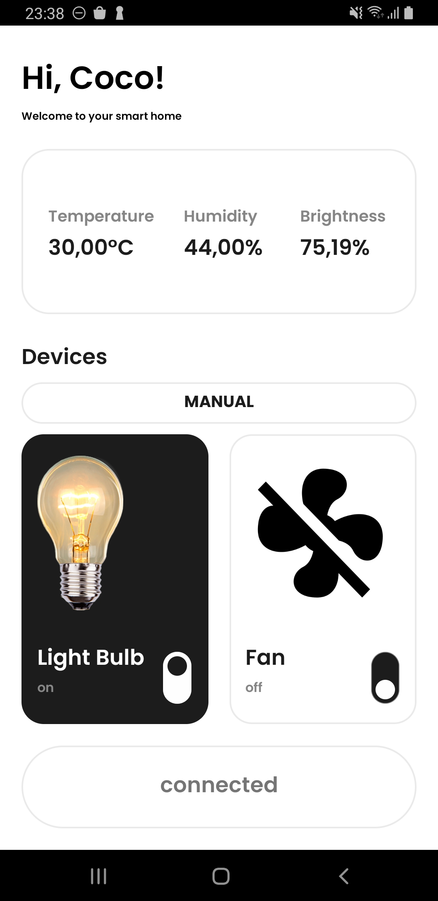

# [OISP_IoT] Android App
This Andorid app is the second part of my IoT Project in my school OISP. This app provide UI for end user to interact with the Smart Home system.

The first part of this project can be seen in this [Github repo](https://github.com/khaiphan29/OISP_UART-Gateway)

## User Interface (UI)

The UI of this application is only compatible with Samsung A8+ (or any devices that have the same screen dimension) since I use Linear Layout to design.

The design is based on those Dribble UI designs:
+ [Smart Home App by Alexander Kontsevoy for Ronas IT](https://dribbble.com/shots/18326953-Smart-Home-App)
+ [iPad Smart Home App UI by Ronas IT](https://dribbble.com/shots/20982911-iPad-Smart-Home-App-UI)

## Features
+ The app can display the connection status as well as the room's measurements.
+ User can manually control the light and fan.
+ Activate auto function, which will control the light and fan automactically depending on human detection via webcam of the computer running the gatewat

## Note
This application only work well when the Gateway is activated since it has to wait for the reponse from Gateway to make the button work (2-hop Protocol)

If you want an app that can simply run without the need of Gateway activation, you can watch basic instructions of this project on [Github repo](https://github.com/khaiphan29/OISP_UART-Gateway)